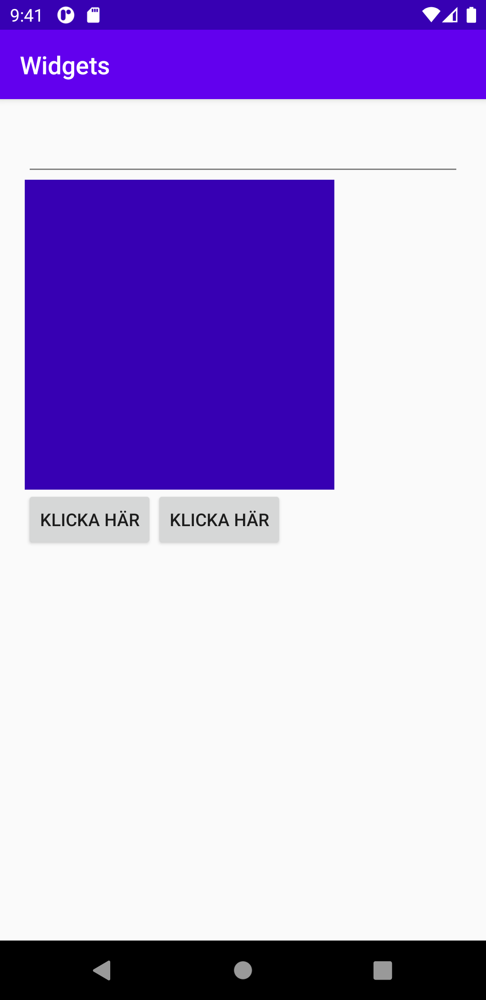
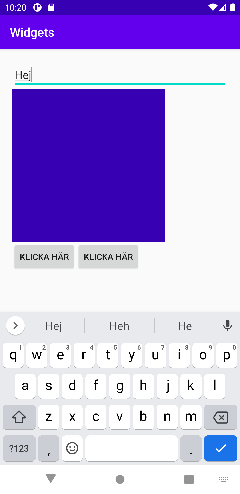
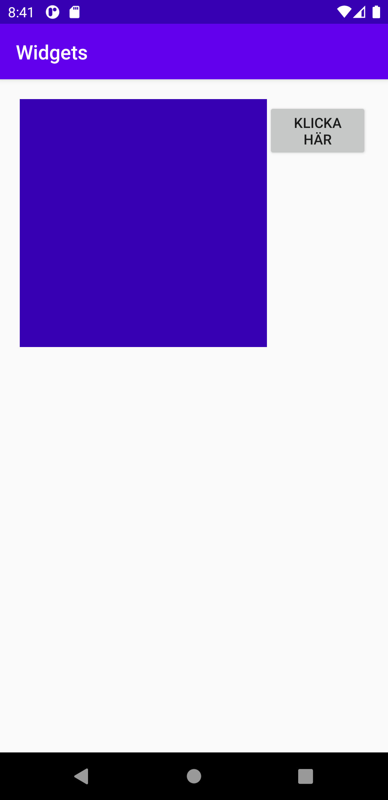

# Rapport

Jag använde mig av Linearlayout. Därefter så lade jag först till en knapp och skrev vad knappen skulle heta samt ett tillhörande ID till knappen.
ID är unikt för den knappen och gjorde det möjligt att kunna få till kodningen i MainActivity för att det skulle gå att klicka på knappen i appen och skicka
datan som hade skrivits ut i MainActivity. Därefter lade jag till ImageView och EditText. I ImageView valde jag att lägga till en färg istället för en bild
samt att jag lade till hur bred och hög bilden skulle vara. EditText gjorde jag även där möjligt att istället för att skicka data som i knappen så kunde man
skriva en text i appen och sedan skicka datan.

```
<LinearLayout xmlns:android="http://schemas.android.com/apk/res/android"
```
Linearlayout valdes

```
android:id="@+id/button"
```
ID för att göra denna knapp unik

```
android:orientation="vertical"
```
Jag ändrade positioneringen för alla widgets med hjälp av denna kod. Innan jag lade till den kodsnutten såg appen ut så som visas på bild 3, och när jag
lade till koden så fick jag resultatet som visas på bild 1.
För att sedan ändra positionering på alla widgets lade jag till en Linearlayout i den redan tidigare existerande Linearlayout. Koden med Linearlayout och
Button som visas här nedanför visar att det bland annat är den knappen som ligger inuti den andra Linearlayout som skapades. EditText ligger inte inuti den andra
Linearlayout eftersom att då skulle den hamna bredvid de andra två knapparna och då skulle de resultera i väldigt lite yta att skriva något i den i appen,
så istället lades EditText ovanför allt som visas på bild 2 och det blev det slutgiltiga resultatet av appen.


```
<LinearLayout
        android:layout_width="wrap_content"
        android:layout_height="wrap_content">

    <Button
        android:id="@+id/button"
        android:layout_width="wrap_content"
        android:layout_height="wrap_content"
        android:text="Klicka här" />
```

```
<EditText
        android:id="@+id/plain_text_input"
        android:layout_height="wrap_content"
        android:layout_width="match_parent"
        android:inputType="text"/>
```





